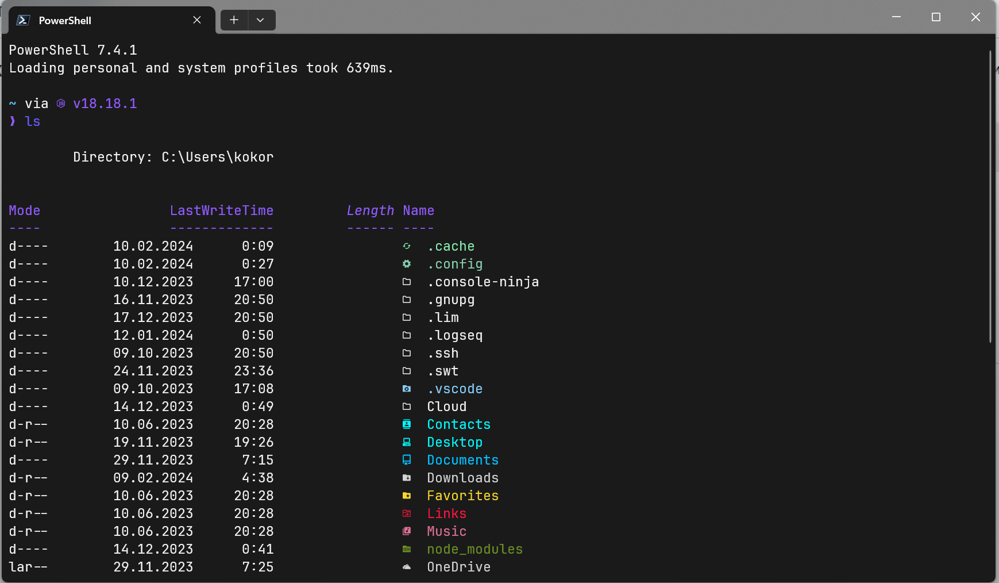

# Кастомизация Windows Terminal c PowerShell

</img>

## Что потребуется

1. Установить Windows Terminal;
2. Шрифты [Nerd Font](https://www.nerdfonts.com/font-downloads) (мое предпочтение JetBrains Mono);
3. Установить [Oh my posh](https://ohmyposh.dev/)
4. Установить [Starship](https://starship.rs/ru-RU/guide) (автокомплит подсказок)
5. [Z](https://github.com/badmotorfinger/z) (Быстрое перемещение по файловой системе)

## Шрифт и иконки

1. Установить **шрифт** [Nerd Font](https://www.nerdfonts.com/font-downloads) (мое предпочтение JetBrains Mono);
2. Применить применить его в Windows Terminal;
3. Для применения **иконок** в терминале ввести:

    ```PowerShell
    Install-Module -Name Terminal-Icons -Repository PSGallery
    ```

4. В файле `Microsoft.PowerShell_profile.ps1` указать:
    ```PowerShell
    Import-Module -Name Terminal-Icons
    ```

## Установка OH MY POSH

1. Для установки [Oh my posh](https://ohmyposh.dev/) необходимо ввести в терминале:
    ```PowerShell
    winget install JanDeDobbeleer.OhMyPosh -s winget
    ```
2. Создать файл `Microsoft.PowerShell_profile.ps1` в пути, который будет выведен командой `$PROFILE`
    ```Powershell
    > $PROFILE
    C:\Path...
    ```
3. В файле `Microsoft.PowerShell_profile.ps1` указать:
    ```Powershell
    oh-my-posh init pwsh --config "C:\Users\*name\AppData\Local\Programs\oh-my-posh\themes\dracula.omp.json" | Invoke-Expression
    ```

## Тема

1. Ввести в терминале:
    ```Powershell
    oh-my-posh init pwsh --config "C:\Users\*name\AppData\Local\Programs\oh-my-posh\themes\dracula.omp.json" | Invoke-Expression
    ```

## Установка Starship
1. Установить `Starship` через терминал: 
    ```PowerShell
    winget install --id Starship.Starship
    ```
2. Указать в `Microsoft.PowerShell_profile.ps1`:
    ```PowerShell
    winget install --id Starship.Starship
    ```

## Установка Z
1. Ввести в терминале:

    ```Powershell
    Install-Module z -AllowClobber
    ```
